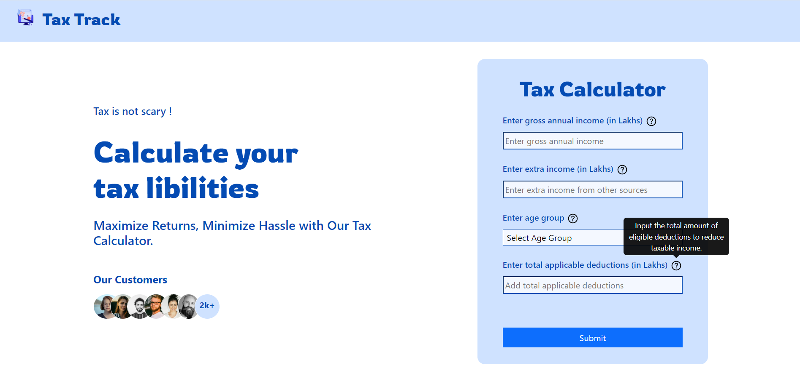
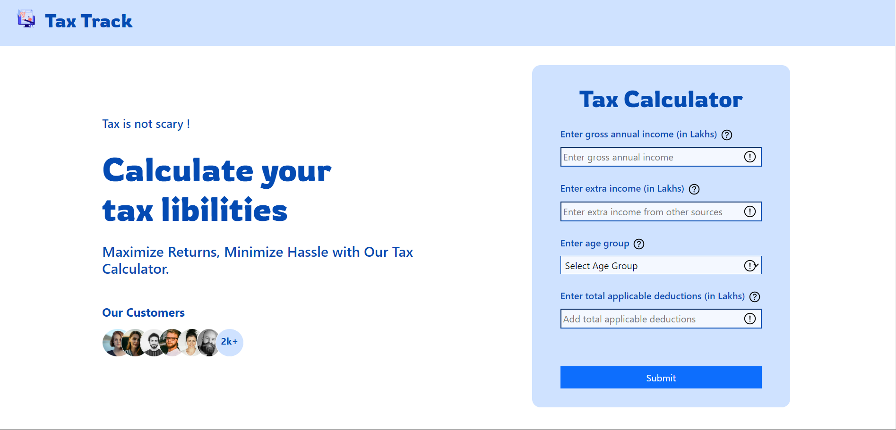
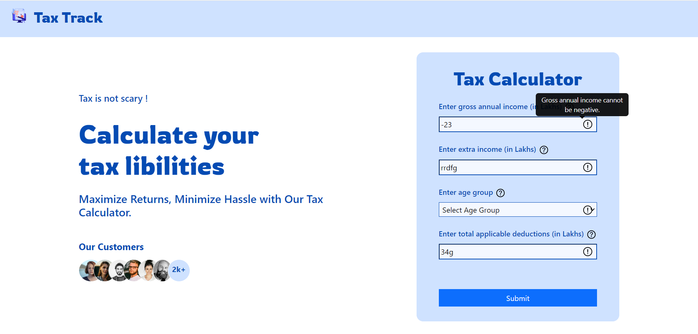
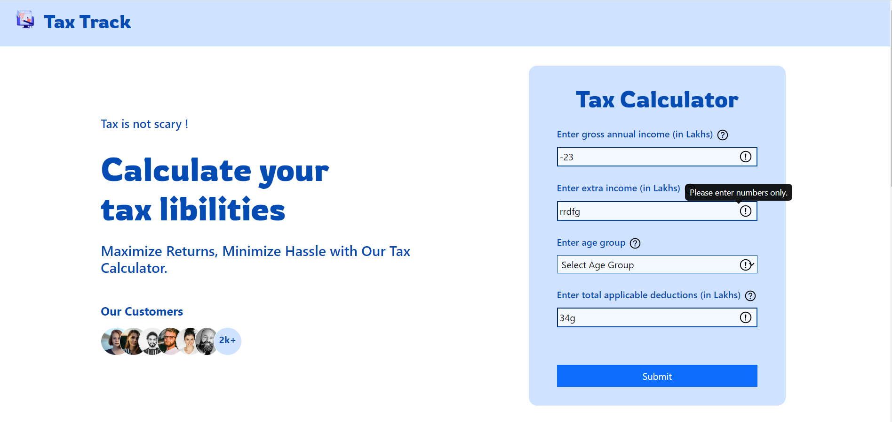
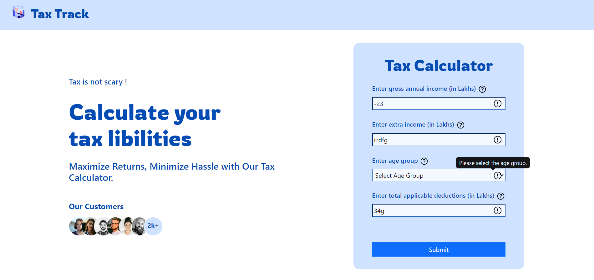
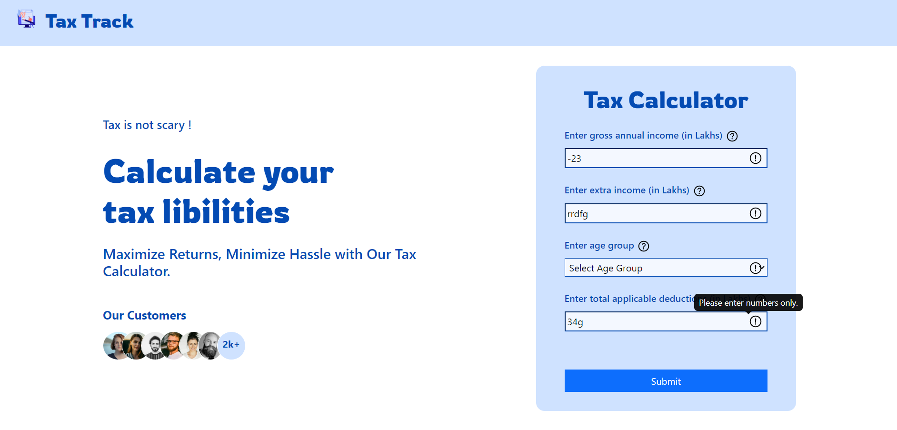
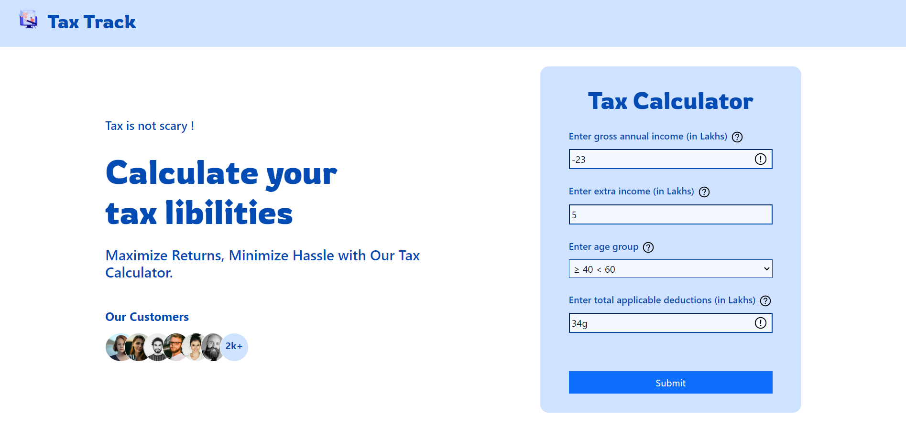
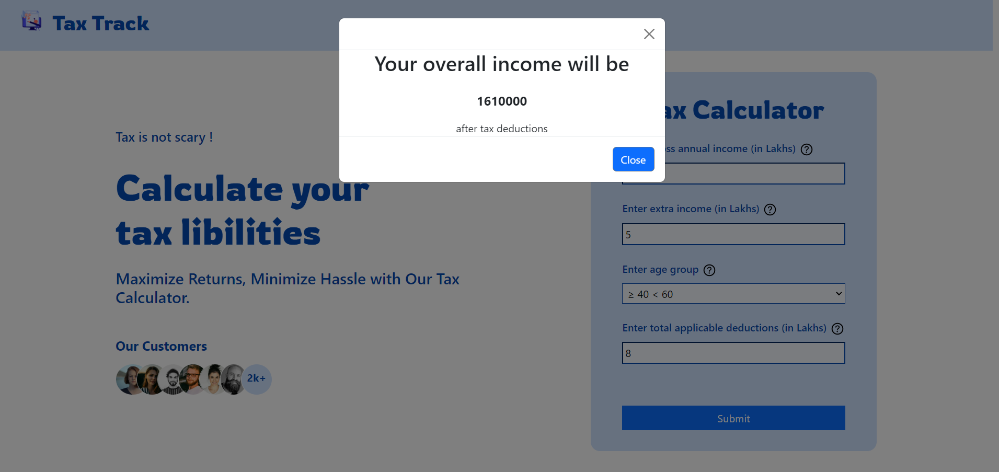

# tax-calculator

This tax calculator calculates their taxes based on their income, age, and deductions. All necessary validations have been implemented to ensure accurate inputs and reliable calculations. Additionally, various frontend components have been included to enhance the user interface and provide a better user experience. The website is well responsive.

# All test cases

1. At the outset, the screen presents an initial layout. Upon hovering over the help icon, users can access detailed descriptions through tooltips
   

2. If the form is submitted with empty input(s), it will show error. alert icon will be visible and after hovering on it, error will display.
   

3. If input is negative value, it will show error message as shown.
   

4. If input is character or string, it will show error as "please enter numbers only".
   

5. If no dropdown option is selected for the age group, an error will be displayed as 'Please select the age group'.
   

6. If a number appended with characters is submitted, an error will also be displayed.
   

7. When the input is corrected, the error icons disappear. If the input is not corrected, the errors will remain visible.
   

8. If all inputs are correctly submitted, the result will be displayed.
   
